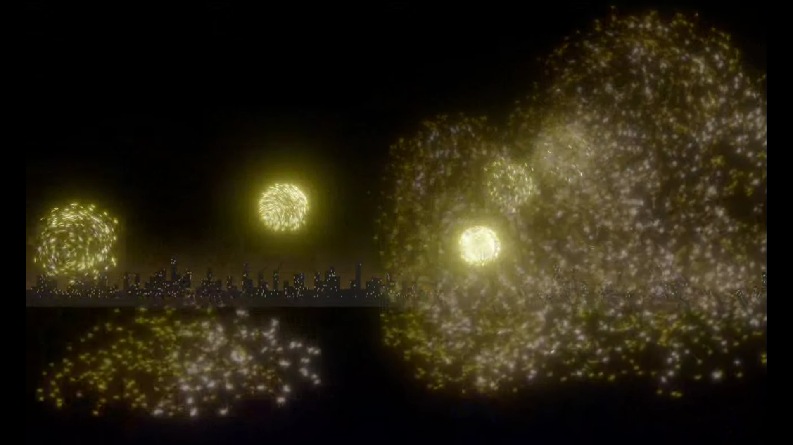
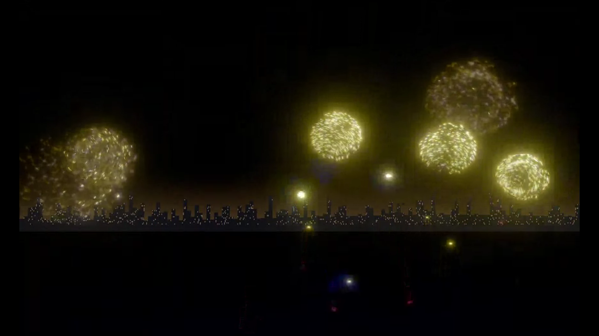
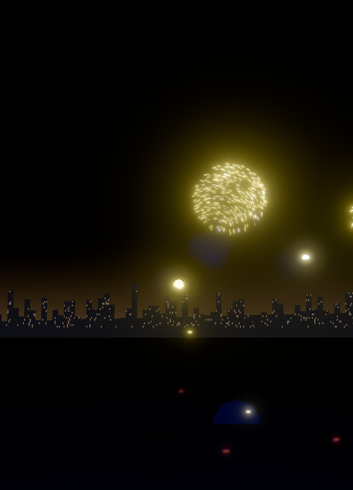

# firewrks

A realistic, endless aerial **fireworks show** rendered with **WebGPU**. One click starts a
non-repeating ambient display driven by a catalog of real firework products — peonies,
chrysanthemums, willows, palms, strobes, crackling shells, cakes — over a procedural city skyline,
with a persistent smoke atmosphere that lights and hazes later bursts.

Because the render is pure WebGPU, it also ships with a **WebRTC cast path**: render on any
WebGPU-capable machine and stream the picture to a display that has no WebGPU of its own (an older
Android TV, a kiosk panel, a set-top box) — the display just plays a video track.



## Highlights

- **Endless, seeded, deterministic show** — a low-frequency intensity envelope breathes between
  sparse lulls and denser volleys; a fixed seed reproduces an identical show (no `Math.random()`
  anywhere).
- **Grounded in real products** — every effect in `catalog/*.json` records its source URL,
  publisher, and verbatim product text alongside the normalized effect vocabulary.
- **Deliberately imperfect physics** — curl-noise turbulence, per-star lifetime/speed/angle
  jitter, asymmetric breaks, ragged trails, dud stars, and a decaying 3D smoke field.
- **Full render pipeline** — velocity-stretched sprite stars, MRT emissive + selective bloom,
  hue-preserving tonemap, auto-exposure, break-flash, burst-light-lit ground and smoke, and a
  procedural skyline horizon.
- **Cast anywhere** — WebRTC publisher + a tiny signaling server + a display-only receiver
  (browser page or an Android TV APK).
- **Procedural audio** — synthesized mortar thumps and speed-of-sound-delayed booms, panned to
  each burst; routed to the remote display when casting.

| Wide show | Close-up |
|---|---|
|  |  |

## Quick start (local)

Requires Node.js and a Chromium-based browser with WebGPU (Chrome on macOS is the reference).
`http://localhost` is a secure context, so no HTTPS setup is needed.

```sh
npm install
npm run build
npm run serve          # serves the built app on http://localhost:4173
```

Open the printed URL, click **Start**, and mirror the window to a screen (AirPlay / any
screen-share) if you like. The seed field reproduces a specific show; `?seed=<n>` prefills it.
For development, `npm run dev` runs Vite's dev server directly.

## Cast to a display without WebGPU

Render on the capable machine, play the pixels anywhere. See
**[docs/webrtc-cast.md](docs/webrtc-cast.md)** for the full walkthrough; in short:

```sh
npm run build
npm run cast           # signaling + static server on 0.0.0.0:8765
```

1. **Publisher** — open a WebGPU browser on the render machine at
   `http://localhost:8765/?autostart=1&stream=1`.
2. **Receiver** — point any display's browser at `http://<render-host-ip>:8765/tv`, or install the
   [Android TV APK](docs/android-client.md) and type the host `ip:port` on its start screen.

Media flows peer-to-peer over the LAN; only signaling touches the server. The codec/bitrate are
tuned for reliable playback on weak hardware decoders (VP9 by default).

## Documentation

- **[docs/architecture.md](docs/architecture.md)** — system overview: the CPU show pipeline
  (planner → compiler → allocator → simulation) and the GPU render pipeline, plus the cast
  subsystem as a generic "render-remote, display-dumb" pattern.
- **[docs/webrtc-cast.md](docs/webrtc-cast.md)** — the WebRTC cast pipeline in depth: signaling
  protocol, codec/bitrate decisions, firewall notes, run instructions.
- **[docs/android-client.md](docs/android-client.md)** — the Android TV cast-receiver APK: build,
  install, host configuration, and how the WebView client works.
- **[AGENTS.md](AGENTS.md)** — contributor/agent guide: commands, conventions, invariants.

## Testing

```sh
npm test               # Vitest: catalog schema, compiler, planner, allocator, atmosphere, audio
npm run typecheck      # tsc --noEmit
```

Everything under `test/` is CPU-only and deterministic. GPU/visual behavior is verified
interactively (there is no automated visual-regression harness).

## Project layout

```
server/index.mjs          Static server for the local show (127.0.0.1)
server/stream.mjs         WebRTC signaling + static server for casting (0.0.0.0)
server/tv.html            WebRTC receiver page (display-only client)
src/main.ts               Boot/UI, capability probe, show loop, cast publisher wiring
src/platform/             Capability probe, DPR/resolution, procedural audio, WebRTC publisher
src/show/                 Catalog schema + data, planner, compiler, allocator (CPU-only, tested)
src/gpu/                  Particle sim, renderer/post pipeline, smoke atmosphere (TSL/WebGPU)
android/                  Android TV cast-receiver APK (framework-only WebView, hand-built)
catalog/                  Real firework product documents (+ generic shells)
docs/                     Architecture, cast, and Android docs
test/                     Vitest unit tests
```

## License

MIT — see [LICENSE](LICENSE).
