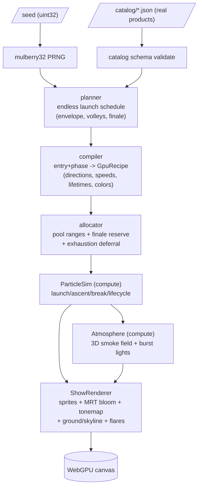
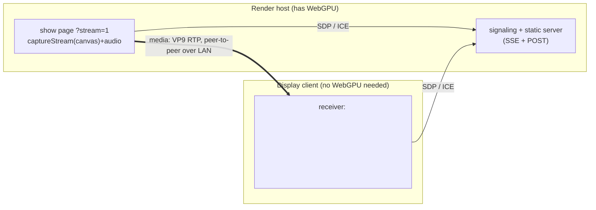

# Architecture

Two independent subsystems:

1. **The show** — a deterministic pipeline that turns a seed + a product catalog into a
   continuously rendered WebGPU scene.
2. **The cast** — an optional, application-agnostic way to display any WebGPU (or any `<canvas>`)
   render on a device that can't run it, by streaming the picture over WebRTC.

They share nothing but the canvas: the cast subsystem captures whatever the show draws.

---

## 1. The show

### CPU side (pure, deterministic, unit-tested — `src/show/`)

- **`rng.ts`** — a seeded `mulberry32` PRNG and helpers. Every stochastic decision in the whole
  system draws from a seed; there is no `Math.random()`. A fixed seed reproduces an identical show.
- **`catalog.ts`** — schema + validation for `catalog/*.json`. Each entry is a real firework
  product with provenance (source URL, publisher, verbatim text) plus a normalized effect
  vocabulary (break family, caliber, colors, effect tags, device type, shot count).
- **`planner.ts`** — an endless generator of scheduled launches. A low-frequency intensity
  envelope (sum of two slow sinusoids of the seed) breathes between sparse lulls and denser
  stretches; escalation waves and finales are small rolling volleys, and cakes expand into their
  shot runs. No wall-clock; the schedule is a pure function of the seed.
- **`compiler.ts`** — turns one `(entry, phase, rng)` into a `GpuRecipe`: per-star directions
  (by break-family topology + angular noise + shell deformation), speeds, heavy-tailed lifetimes,
  a color ramp, trail/secondary parameters, and flags. Pure typed-array output.
- **`allocator.ts`** — hands out contiguous ranges of the fixed particle pool, keeps a finale
  reserve, recycles expired ranges, and reports exhaustion so callers defer (never drop) a launch.

### GPU side (TSL / WebGPU — `src/gpu/`)

- **`sim.ts`** — `ParticleSim`: compute passes for launch, ascent, fuse-timed break, and the
  per-tick lifecycle, over the pool. Exposes render buffers (position, color, age, life, behavior).
- **`atmosphere.ts`** — `Atmosphere`: a ping-pong 3D smoke density field (advect / diffuse / decay
  / inject) plus CPU-side burst-light selection (top-N with hysteresis and crossfade). Both the
  smoke sprites and the renderer's ground/skyline read the same burst lights.
- **`render.ts`** — `ShowRenderer`: velocity-stretched sprite stars, an MRT emissive channel
  feeding selective bloom, a hue-preserving tonemap with auto-exposure, break-flash, a burst-light-
  lit ground plane, a procedural city-skyline horizon, and anamorphic flare streaks.

### Driver (`src/main.ts`)

Owns the fixed-timestep loop: a planner event pump (with a deferral queue and a break min-heap), a
`stepOnce()` sim tick, and `render()` per displayed frame with accumulator interpolation. Also
hosts the idle/Start UI, the WebGPU capability probe, interactive click-to-launch, and — in cast
mode — the publisher wiring. Preallocates all per-tick scratch (the steady-state loop must not
allocate).

---

## 2. The cast (render-remote, display-dumb)

A generic pattern for showing a GPU render on a device that can't produce it. Nothing here is
specific to fireworks — it casts whatever is on the canvas.

- **Publisher** (`src/platform/webrtcPublisher.ts`) — wraps a `MediaStream`
  (`canvas.captureStream()` + the audio capture tap) in an `RTCPeerConnection`, prefers a codec the
  target can hardware-decode, sets a fixed bitrate, and re-offers whenever a viewer joins.
- **Signaling + static server** (`server/stream.mjs`) — serves the app (for the publisher) and the
  receiver page, and relays SDP/ICE between the two roles over SSE + POST. No media passes through
  it; no third-party dependencies.
- **Receiver** — either `server/tv.html` (any browser) or the Android APK (`android/`), a
  display-only client that answers the offer and plays the remote track. The receiver needs no GPU
  beyond a video decoder.

Media is peer-to-peer over the LAN via host ICE candidates; only signaling crosses the server.
Codec/bitrate defaults are chosen for reliable playback on weak set-top-box decoders — see
[webrtc-cast.md](webrtc-cast.md) for the measured rationale.

---

## Design invariants

- **Determinism.** Seed in, identical show out. All randomness flows through the seeded PRNG.
- **No per-tick allocation.** The steady-state driver loop reuses preallocated scratch.
- **Fixed pool, never drop.** The particle pool is a fixed size; exhaustion defers launches with a
  reserve kept for finales.
- **One burst-light selection** drives ground, smoke, and flares.
- **Frozen numeric contract.** World scale, jitter, and decay constants live in
  `src/show/constants.ts`; other modules read them rather than re-typing magic numbers.
