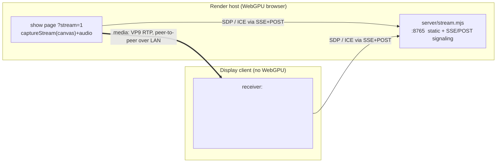

# Casting to a display without WebGPU

The show renders with **WebGPU** (compute + storage-3D-texture atmosphere; no WebGL fallback), so
it can only run on a WebGPU-capable browser. To show it on a display that lacks WebGPU — an older
Android TV, a kiosk panel, a set-top box — **render on a capable machine and stream the picture**
over WebRTC. The display only plays a `<video>` track, which any modern-enough WebView/browser
handles regardless of WebGPU support.



Only **signaling** (SDP + ICE) crosses the server. **Media flows peer-to-peer** over the LAN once
negotiated.

## Components

| File | Role |
|------|------|
| `server/stream.mjs` | Pure-Node server. Serves the built app (`dist/`) for the publisher, serves the receiver page at `/tv`, and relays signaling over SSE (`GET /sig/sub/<role>`) + POST (`POST /sig/send/<role>`). Binds `0.0.0.0:8765`. No dependencies. |
| `server/tv.html` | Browser **receiver** (role `tv`). Fullscreen autoplay `<video>`; answers the publisher's offer, plays the remote track unmuted. |
| `src/platform/webrtcPublisher.ts` | WebRTC **publisher** (role `pub`). Wraps a `MediaStream` in an `RTCPeerConnection`, prefers VP9, sets a fixed bitrate ceiling, re-offers on every viewer join. |
| `src/main.ts` | `?stream=1` mode: after the show starts, `captureStream(30)` of the WebGPU canvas + the show's audio track → `startPublisher`. `?autostart=1` skips the idle Start screen. |
| `src/platform/audio.ts` | `ShowAudio(rng, outputLocal)` exposes an `audioTrack` capture tap; in cast mode `outputLocal=false` so audio plays on the **display**, not the render host. |
| `android/` | An Android TV receiver APK — same job as `tv.html`, with an on-device host-entry screen. See [android-client.md](android-client.md). |

## Signaling protocol (SSE + POST, no WebSocket dependency)

Two roles, `pub` and `tv`. Each subscribes to its own event stream and POSTs to the other's:

- `GET /sig/sub/pub` / `GET /sig/sub/tv` — Server-Sent Events stream for that role. Messages are
  buffered until the role connects, so nothing is lost to a startup race.
- `POST /sig/send/pub` / `POST /sig/send/tv` — deliver one JSON message to that role.
- When `tv` subscribes, the server pushes `{type:"viewer-ready"}` to `pub`, the publisher's cue to
  (re)create an offer. The display can join or reload at any time; the publisher tears down any
  stale peer connection and re-offers.

Relayed message types: `offer` / `answer` (`{type, sdp}`) and `ice` (`{type, candidate}`).

## Codec & bitrate

WebRTC negotiates a codec both ends support. On weak display hardware the decoder — not the
network — is the constraint, so the publisher **prefers a codec the target can hardware-decode**
and holds a **fixed, moderate bitrate**. Defaults: **VP9 at 8 Mbps**, no bitrate ramp, no SDP
munging, resolution/framerate at negotiated defaults.

Why these defaults (measured against a real weak set-top decoder):

- **Codec matters.** Query the device's decoders (`/etc/media_codecs*.xml`) and prefer one it lists
  as a hardware decoder *and* that WebRTC can negotiate (VP8, VP9, H264 — not HEVC/AV1 in most
  browsers). On the reference device VP8 hardware-decoded but showed a stride band and corrupted
  under load; forced H264 produced zero frames (profile mismatch); **VP9 was clean and efficient.**
- **Fixed, moderate bitrate.** Too low starves the chroma planes on a mostly-black scene (gold
  reads green, sky blocks into navy). Too high — or a bitrate that *ramps up* mid-stream — desynced
  the hardware decoder into full-frame garbage. A single moderate ceiling avoids both.

To retarget a different display, change the preferred codec / bitrate in `webrtcPublisher.ts`.

## Audio

`ShowAudio` sums to a compressor, then to both the local speakers *and* a
`MediaStreamAudioDestinationNode`. In cast mode (`outputLocal=false`) the local-speaker path is
skipped, so the render host is silent and sound comes out of the **display** via the captured
track. The receiver plays `<video>` unmuted, with a muted fallback if the UA refuses unmuted
autoplay.

## Running it

Prereqs: render host and display on the same LAN, a WebGPU browser on the host.

```sh
# 0. build the web bundle
npm run build

# 1. signaling + static server (render host)
npm run cast            # binds 0.0.0.0:8765

# 2. publisher — a WebGPU browser on the host, in a 16:9 window for a full-frame capture:
#    open  http://localhost:8765/?autostart=1&stream=1
#    (Use a real GPU-backed browser window; a software/headless renderer is slow and may capture
#     an off-aspect surface.)

# 3. receiver — any display's browser:
#    open  http://<render-host-ip>:8765/tv
#    or install the Android APK and enter <render-host-ip>:8765 on its start screen.
```

### macOS firewall

If the render host runs the macOS application firewall, allow inbound to `node` (signaling) and the
publisher browser (WebRTC media), or the display connects to signaling but never receives frames:

```sh
FW=/usr/libexec/ApplicationFirewall/socketfilterfw
sudo "$FW" --add "$(readlink -f "$(which node)")"; sudo "$FW" --unblockapp "$(readlink -f "$(which node)")"
sudo "$FW" --add "/Applications/Google Chrome.app"; sudo "$FW" --unblockapp "/Applications/Google Chrome.app"
```

### Fallback: adb reverse tunnel (Android receiver)

If direct inbound to the host is blocked and can't be allowed, tunnel the **TCP signaling** over
adb and point the receiver at `localhost` — media still travels LAN-direct (UDP):

```sh
adb -s <device> reverse tcp:8765 tcp:8765
adb -s <device> shell am start -n com.firewrks.tv/.MainActivity -e url "http://localhost:8765/tv"
```

## Known limits

- The publisher must run in a GPU-backed browser window; a headless/software renderer is slow and
  may capture an off-aspect (e.g. portrait) surface.
- One viewer at a time (the relay keeps a single `pub`/`tv` slot each).
- Interactive input (D-pad/click) currently fires shells only in the locally-rendered path, not
  through the cast; forwarding remote keypresses to the publisher is a possible enhancement.

## Reference device

Verified end-to-end on an Android 11 set-top box (System WebView 111, no WebGPU) rendered from
Chrome on macOS: install + launch, WebView loads the receiver, the 900 KB+ show bundle streams, and
VP9 hardware-decodes cleanly over the LAN.
